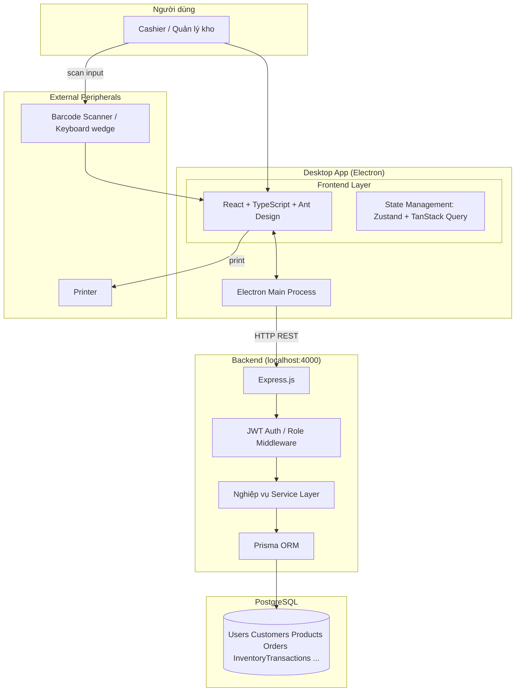
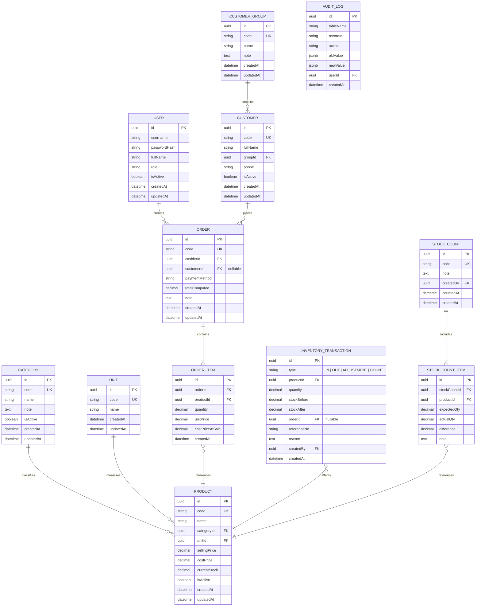
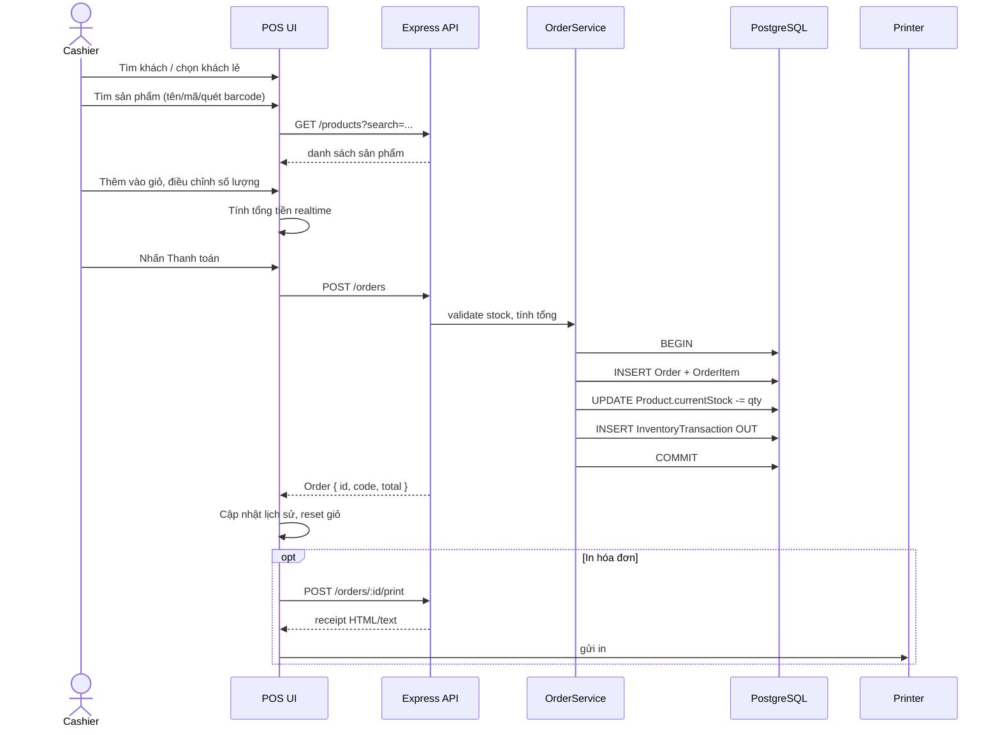
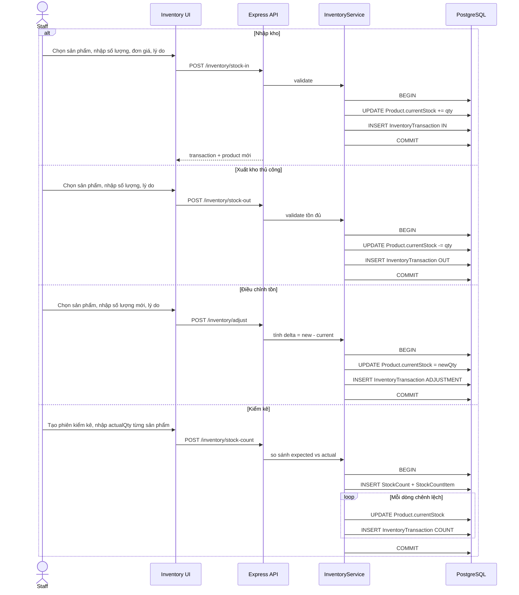

# Phần mềm Quản lý Căn tin — Thiết kế Solution Architecture

> Vai trò: Software Solution Architect cấp cao  
> Công nghệ: Electron + React + TypeScript + Ant Design + Node.js + Express + REST API + PostgreSQL + Prisma

---

## 1. Kiến trúc tổng thể hệ thống

### Quyết định thiết kế

- **Desktop-first với Electron**: căn tin cần màn POS nhanh, ổn định, in phiếu, quét mã, kết nối nội bộ LAN — Electron đáp ứng tốt hơn web app.
- **Backend Express REST API tách biệt**: dễ unit test, tích hợp POS kiosk/remote, đảm bảo nghiệp vụ transaction (bán hàng + tồn kho) nằm ở server.
- **PostgreSQL + Prisma**: ACID transaction cho bán hàng/nhập kho, Prisma giúp đảm bảo type-safe, migration tự động, dễ bảo trì schema.
- **Single local deployment cho MVP**: Electron embedded API server (`electron` spawn `dist/server.js`) để khách hàng cài một phần mềm duy nhất; vẫn giữ cổng API riêng (`localhost:4000`) để sau này mở rộng LAN hoặc cloud.
- **Offline-first POS cơ bản**: giao dịch bán hàng luôn đi qua backend; nếu mất kết nối hiếm gặp trên máy local thì thông báo lỗi và retry, không cache phức tạp giai đoạn MVP.

### Sơ đồ kiến trúc (Mermaid)



---

## 2. Cấu trúc thư mục

### Quyết định thiết kế

- **Workspace monorepo bằng npm workspaces** thay vì Nx/Turborepo: MVP đơn giản, giảm cognitive load, dễ build/pack.
- **Backend chia 3 tầng**: `routes` (HTTP interface) → `services` (business rules) → `repositories` (Prisma), dễ test, dễ mock.
- **Frontend chia theo feature**: `features/master-data`, `features/pos`, `features/inventory` để đội có thể làm song song.
- `shared/` chứa types/API contract để đồng bộ TS giữa frontend/backend (có thể publish sau này).

```
quan-ly-can-tin/
├── DESIGN.md                 # tài liệu này
├── package.json              # npm workspaces, scripts build/pack
├── tsconfig.json             # root tsconfig references
├── .env.example              # DATABASE_URL, JWT_SECRET
│
├── apps/
│   ├── backend/              # Express + Prisma
│   │   ├── package.json
│   │   ├── tsconfig.json
│   │   ├── src/
│   │   │   ├── index.ts      # entry khởi động server
│   │   │   ├── app.ts        # express app (router + middleware)
│   │   │   ├── config.ts
│   │   │   ├── prisma.ts     # singleton PrismaClient
│   │   │   ├── middleware/
│   │   │   │   ├── auth.ts
│   │   │   │   ├── errorHandler.ts
│   │   │   │   └── validate.ts
│   │   │   ├── routes/
│   │   │   │   ├── auth.routes.ts
│   │   │   │   ├── users.routes.ts
│   │   │   │   ├── customers.routes.ts
│   │   │   │   ├── products.routes.ts
│   │   │   │   ├── categories.routes.ts
│   │   │   │   ├── units.routes.ts
│   │   │   │   ├── orders.routes.ts
│   │   │   │   ├── inventory.routes.ts
│   │   │   │   └── reports.routes.ts
│   │   │   ├── services/
│   │   │   │   ├── auth.service.ts
│   │   │   │   ├── customer.service.ts
│   │   │   │   ├── product.service.ts
│   │   │   │   ├── order.service.ts
│   │   │   │   ├── inventory.service.ts
│   │   │   │   └── report.service.ts
│   │   │   ├── repositories/
│   │   │   │   ├── customer.repo.ts
│   │   │   │   ├── product.repo.ts
│   │   │   │   ├── order.repo.ts
│   │   │   │   └── inventory.repo.ts
│   │   │   └── utils/
│   │   │       ├── jwt.ts
│   │   │       ├── bcrypt.ts
│   │   │       └── response.ts
│   │   └── prisma/
│   │       ├── schema.prisma
│   │       ├── migrations/
│   │       └── seed.ts
│   │
│   └── frontend/             # Electron + React
│       ├── package.json
│       ├── tsconfig.json
│       ├── vite.config.ts
│       ├── electron.vite.config.ts
│       ├── electron/
│       │   ├── main.ts       # Electron main process
│       │   └── preload.ts    # contextBridge API
│       ├── src/
│       │   ├── main.tsx
│       │   ├── App.tsx       # 3 tabs: Master Data / POS / Inventory
│       │   ├── api/          # axios instance + endpoints
│       │   ├── hooks/        # TanStack Query hooks
│       │   ├── stores/       # Zustand stores
│       │   ├── components/   # chung: AppLayout, PageHeader, v.v.
│       │   ├── features/
│       │   │   ├── master-data/
│       │   │   │   ├── customers/
│       │   │   │   │   ├── CustomerList.tsx
│       │   │   │   │   └── CustomerForm.tsx
│       │   │   │   └── products/
│       │   │   │       ├── ProductList.tsx
│       │   │   │       └── ProductForm.tsx
│   │   │   │   ├── pos/
│   │   │   │   │   ├── PosPage.tsx
│   │   │   │   │   ├── CartPanel.tsx
│   │   │   │   │   ├── ProductSearch.tsx
│   │   │   │   │   ├── CustomerSearch.tsx
│   │   │   │   │   ├── PaymentModal.tsx
│   │   │   │   │   └── OrderHistory.tsx
│   │   │   │   └── inventory/
│   │   │   │       ├── InventoryPage.tsx
│   │   │   │       ├── StockIn.tsx
│   │   │   │       ├── StockOut.tsx
│   │   │   │       ├── StockAdjustment.tsx
│   │   │   │       ├── StockCount.tsx
│   │   │   │       └── InventoryHistory.tsx
│   │   │   ├── types/
│   │   │   └── utils/
│   │   └── index.html
│   │
└── shared/
    ├── package.json
    ├── tsconfig.json
    └── src/
        ├── api-types.ts      # DTO/request/response shape
        ├── enums.ts
        └── index.ts
```

---

## 3. Database schema (ERD + danh sách bảng)

### Quyết định thiết kế

- Mỗi sản phẩm lưu `currentStock` snapshot để query POS nhanh, đồng thời lưu `InventoryTransaction` chi tiết để kiểm tra.
- `Order` + `OrderItem` lưu giá tại thời điểm bán (`unitPrice`) để hỗ trợ báo cáo doanh thu chính xác dù giá sản phẩm sau này thay đổi.
- `InventoryTransaction` gồm type `IN`, `OUT`, `ADJUSTMENT`, `COUNT`; reference đến `orderId` khi xuất bán.
- Không lưu `total` tính toán trong `Order` (computed) để tránh mismatch.
- `auditLog` để truy vết sau này.

### ERD (Mermaid)



### Danh sách bảng chi tiết

#### `User` — Người dùng hệ thống
| Cột | Kiểu | Ghi chú |
|---|---|---|
| id | UUID PK | mặc định gen_random_uuid() |
| username | VARCHAR(50) UNIQUE NOT NULL | dùng đăng nhập |
| passwordHash | VARCHAR(255) NOT NULL | bcrypt |
| fullName | VARCHAR(100) NOT NULL | |
| role | VARCHAR(20) NOT NULL | ADMIN, MANAGER, CASHIER, WAREHOUSE |
| isActive | BOOLEAN DEFAULT true | |
| createdAt | TIMESTAMPTZ DEFAULT now() | |
| updatedAt | TIMESTAMPTZ | |

#### `CustomerGroup` — Nhóm người mua
| Cột | Kiểu | Ghi chú |
|---|---|---|
| id | UUID PK | |
| code | VARCHAR(20) UNIQUE NOT NULL | |
| name | VARCHAR(100) NOT NULL | |
| note | TEXT | |
| createdAt | TIMESTAMPTZ DEFAULT now() | |
| updatedAt | TIMESTAMPTZ | |

#### `Customer` — Người mua
| Cột | Kiểu | Ghi chú |
|---|---|---|
| id | UUID PK | |
| code | VARCHAR(20) UNIQUE NOT NULL | mã khách |
| fullName | VARCHAR(100) NOT NULL | |
| groupId | UUID FK → CustomerGroup | |
| phone | VARCHAR(20) | |
| isActive | BOOLEAN DEFAULT true | |
| createdAt | TIMESTAMPTZ DEFAULT now() | |
| updatedAt | TIMESTAMPTZ | |

#### `Category` — Danh mục sản phẩm
| Cột | Kiểu | Ghi chú |
|---|---|---|
| id | UUID PK | |
| code | VARCHAR(20) UNIQUE NOT NULL | |
| name | VARCHAR(100) NOT NULL | |
| note | TEXT | |
| isActive | BOOLEAN DEFAULT true | |
| createdAt | TIMESTAMPTZ DEFAULT now() | |
| updatedAt | TIMESTAMPTZ | |

#### `Unit` — Đơn vị tính
| Cột | Kiểu | Ghi chú |
|---|---|---|
| id | UUID PK | |
| code | VARCHAR(20) UNIQUE NOT NULL | ly, phần, gói |
| name | VARCHAR(50) NOT NULL | |
| createdAt | TIMESTAMPTZ DEFAULT now() | |
| updatedAt | TIMESTAMPTZ | |

#### `Product` — Sản phẩm
| Cột | Kiểu | Ghi chú |
|---|---|---|
| id | UUID PK | |
| code | VARCHAR(30) UNIQUE NOT NULL | |
| name | VARCHAR(150) NOT NULL | |
| categoryId | UUID FK → Category | |
| unitId | UUID FK → Unit | |
| sellingPrice | DECIMAL(12,2) NOT NULL | giá bán |
| costPrice | DECIMAL(12,2) NOT NULL | giá nhập trung bình/vốn |
| currentStock | DECIMAL(12,2) DEFAULT 0 | tồn kho hiện tại |
| isActive | BOOLEAN DEFAULT true | |
| createdAt | TIMESTAMPTZ DEFAULT now() | |
| updatedAt | TIMESTAMPTZ | |

#### `Order` — Hóa đơn bán hàng
| Cột | Kiểu | Ghi chú |
|---|---|---|
| id | UUID PK | |
| code | VARCHAR(30) UNIQUE NOT NULL | HD-YYYYMMDD-XXXX |
| cashierId | UUID FK → User | |
| customerId | UUID FK → Customer nullable | |
| paymentMethod | VARCHAR(20) NOT NULL | CASH, CARD, TRANSFER |
| totalComputed | DECIMAL(14,2) NOT NULL | tổng tiền (snapshot) |
| note | TEXT | |
| createdAt | TIMESTAMPTZ DEFAULT now() | |
| updatedAt | TIMESTAMPTZ | |

#### `OrderItem` — Chi tiết hóa đơn
| Cột | Kiểu | Ghi chú |
|---|---|---|
| id | UUID PK | |
| orderId | UUID FK → Order | |
| productId | UUID FK → Product | |
| quantity | DECIMAL(12,2) NOT NULL | |
| unitPrice | DECIMAL(12,2) NOT NULL | giá bán tại thời điểm |
| costPriceAtSale | DECIMAL(12,2) NOT NULL | giá vốn tại thời điểm |
| createdAt | TIMESTAMPTZ DEFAULT now() | |

#### `InventoryTransaction` — Giao dịch kho
| Cột | Kiểu | Ghi chú |
|---|---|---|
| id | UUID PK | |
| type | VARCHAR(20) NOT NULL | IN, OUT, ADJUSTMENT, COUNT |
| productId | UUID FK → Product | |
| quantity | DECIMAL(12,2) NOT NULL | dương = tăng, âm = giảm |
| stockBefore | DECIMAL(12,2) NOT NULL | |
| stockAfter | DECIMAL(12,2) NOT NULL | |
| orderId | UUID FK → Order nullable | khi OUT do bán |
| referenceNo | VARCHAR(50) | chứng từ nhập/xuất |
| reason | TEXT | |
| createdBy | UUID FK → User | |
| createdAt | TIMESTAMPTZ DEFAULT now() | |

#### `StockCount` — Phiên kiểm kê
| Cột | Kiểu | Ghi chú |
|---|---|---|
| id | UUID PK | |
| code | VARCHAR(30) UNIQUE NOT NULL | |
| note | TEXT | |
| createdBy | UUID FK → User | |
| countedAt | TIMESTAMPTZ DEFAULT now() | |
| createdAt | TIMESTAMPTZ DEFAULT now() | |

#### `StockCountItem` — Chi tiết kiểm kê
| Cột | Kiểu | Ghi chú |
|---|---|---|
| id | UUID PK | |
| stockCountId | UUID FK → StockCount | |
| productId | UUID FK → Product | |
| expectedQty | DECIMAL(12,2) NOT NULL | |
| actualQty | DECIMAL(12,2) NOT NULL | |
| difference | DECIMAL(12,2) NOT NULL | actual - expected |
| note | TEXT | |

#### `AuditLog`
| Cột | Kiểu | Ghi chú |
|---|---|---|
| id | UUID PK | |
| tableName | VARCHAR(50) NOT NULL | |
| recordId | VARCHAR(50) NOT NULL | |
| action | VARCHAR(20) NOT NULL | CREATE, UPDATE, DELETE |
| oldValue | JSONB | |
| newValue | JSONB | |
| userId | UUID FK → User nullable | |
| createdAt | TIMESTAMPTZ DEFAULT now() | |

---

## 4. Thiết kế màn hình UI

### Quyết định thiết kế

- **Layout 3 tab trái** xuyên suốt: Master Data | POS | Inventory.
- Dùng Ant Design `Layout.Sider` + `Tabs` (hoặc menu chuyển router). Tab active có badge nếu có cảnh báo tồn kho.
- Các màn list dùng `Table` + `Form` modal (CRUD), search/filter ở header.
- POS thiết kế 3 cột: tìm sản phẩm/khách (trái), giỏ hàng + thanh toán (giữa), lịch sử/tóm tắt (phải hoặc drawer).

### Master Data

- **Customers**: bảng có cột Mã, Họ tên, Nhóm, SĐT, Trạng thái, Actions. Nút thêm mở Modal form. Nút sửa preload dữ liệu. Xóa cần confirm nếu khách đã có đơn.
- **Products**: bảng có cột Mã, Tên, Danh mục, ĐVT, Giá bán, Giá nhập, Tồn, Trạng thái. Nút thêm/sửa modal form. Có filter theo danh mục.

### POS

```
┌──────────────────────────────────────────────────────────────┐
│ [Master Data] [POS] [Inventory]      User: Cashier | Logout  │
├──────────────┬───────────────────────┬───────────────────────┤
│ Tìm khách    │                       │   HÓA ĐƠN #HD...      │
│ [search...]  │   Sản phẩm vừa chọn   │ ───────────────────── │
│ Khách lẻ      │   (thẻ sản phẩm /     │ Cà phê đen    x2  40K │
│              │     grid nhanh)       │ Bánh mì       x1  15K │
│ Tìm sản phẩm │                       │ ───────────────────── │
│ [search/bar] │                       │ Tổng:          55,000 │
│              │                       │ Giảm giá:           0 │
│ Grid sản phẩm│                       │ Thanh toán:    55,000 │
│ (paginated)  │                       │ [Tiền mặt] [Chuyển khoản]
│              │                       │ [Thanh toán + In]     │
└──────────────┴───────────────────────┴───────────────────────┘
```

- ProductSearch dùng `AutoComplete` debounce 300ms gọi API.
- CartPanel cho phép +/- số lượng, xóa dòng, tính tổng realtime.
- PaymentModal: chọn phương thức, nhập tiền khách đưa, tính tiền thừa, xác nhận in.
- OrderHistory drawer/tab dưới: danh sách hóa đơn ngày, xem chi tiết, in lại.

### Inventory

- **StockIn / StockOut**: form chọn sản phẩm, nhập số lượng, đơn giá (IN), lý do, số chứng từ. Lưu = tạo InventoryTransaction + cập nhật Product.currentStock trong transaction.
- **StockAdjustment**: chọn sản phẩm, nhập số lượng mới, lý do. Backend tính delta.
- **StockCount**: tạo phiên, chọn nhiều sản phẩm, nhập actualQty, submit tạo ADJUSTMENT tự động cho các dòng chênh lệch.
- **InventoryHistory**: bảng lọc theo type, sản phẩm, ngày.
- **InventoryReport**: tổng hợp tồn đầu, nhập, xuất, tồn cuối (có thể tính real-time từ InventoryTransaction).
- **LowStockAlert**: badge + table sản phẩm dưới ngưỡng (threshold cứng 10, sau MVP cho cấu hình per product).

---

## 5. Danh sách API Endpoint

### Quyết định thiết kế

- Base path: `/api/v1`.
- Auth: login trả `accessToken` JWT, mọi API khác yêu cầu `Authorization: Bearer <token>`.
- DTO dùng Zod validate; Prisma đóng gói transaction.

### Auth
| Method | Path | Mô tả |
|---|---|---|
| POST | /api/v1/auth/login | username/password → JWT |
| GET | /api/v1/auth/me | thông tin user hiện tại |

### Users (admin)
| Method | Path | Mô tả |
|---|---|---|
| GET | /api/v1/users | danh sách |
| POST | /api/v1/users | tạo user |
| PATCH | /api/v1/users/:id | cập nhật |
| DELETE | /api/v1/users/:id | xóa mềm hoặc hard |

### Customer Groups
| Method | Path | Mô tả |
|---|---|---|
| GET | /api/v1/customer-groups | danh sách |
| POST | /api/v1/customer-groups | tạo |

### Customers
| Method | Path | Mô tả |
|---|---|---|
| GET | /api/v1/customers | phân trang, tìm theo mã/tên/SĐT |
| GET | /api/v1/customers/:id | chi tiết |
| POST | /api/v1/customers | tạo |
| PATCH | /api/v1/customers/:id | cập nhật |
| DELETE | /api/v1/customers/:id | xóa (check constraint) |

### Categories & Units
| Method | Path | Mô tả |
|---|---|---|
| GET | /api/v1/categories | |
| POST | /api/v1/categories | |
| GET | /api/v1/units | |
| POST | /api/v1/units | |

### Products
| Method | Path | Mô tả |
|---|---|---|
| GET | /api/v1/products | phân trang, filter active/category, tìm tên/mã |
| GET | /api/v1/products/:id | |
| POST | /api/v1/products | tạo |
| PATCH | /api/v1/products/:id | cập nhật giá, tồn |
| DELETE | /api/v1/products/:id | xóa mềm |
| GET | /api/v1/products/low-stock | cảnh báo hết hàng |

### Orders (POS)
| Method | Path | Mô tả |
|---|---|---|
| GET | /api/v1/orders | lịch sử, filter date range |
| GET | /api/v1/orders/:id | chi tiết |
| POST | /api/v1/orders | tạo đơn, thanh toán, xuất kho trong transaction |
| POST | /api/v1/orders/:id/print | trả dữ liệu in (hoặc stream) |

### Inventory
| Method | Path | Mô tả |
|---|---|---|
| GET | /api/v1/inventory/transactions | lịch sử giao dịch kho |
| POST | /api/v1/inventory/stock-in | nhập kho |
| POST | /api/v1/inventory/stock-out | xuất kho (thủ công) |
| POST | /api/v1/inventory/adjust | điều chỉnh tồn |
| POST | /api/v1/inventory/stock-count | kiểm kê |
| GET | /api/v1/inventory/report | báo cáo tồn kho |

### Reports
| Method | Path | Mô tả |
|---|---|---|
| GET | /api/v1/reports/sales | doanh thu theo ngày |
| GET | /api/v1/reports/inventory | tồn kho hiện tại |
| GET | /api/v1/reports/profit | lãi gộp theo đơn |

---

## 6. Luồng nghiệp vụ bán hàng



### Quyết định

- Bán hàng là transaction duy nhất: nếu một bước fail thì rollback toàn bộ, tránh mất tiền hoặc mất tồn.
- Tính tổng ở backend là canonical; frontend hiển thị tổng preview nhưng không dùng để lưu.
- In hóa đơn tách riêng sau khi đơn đã lưu: nếu in lỗi thì đơn vẫn còn, chỉ cần in lại.

---

## 7. Luồng nghiệp vụ nhập/xuất kho



### Quyết định

- Mọi thay đổi tồn đều qua `InventoryTransaction`, không update trực tiếp `Product.currentStock` từ route.
- Xuất kho thủ công là `OUT` không liên kết `orderId` để phân biệt với xuất bán hàng.
- Kiểm kê lưu lại chi tiết `expected/actual/difference` trước khi tạo transaction điều chỉnh.

---

## 8. Thiết kế phân quyền người dùng

### Vai trò

| Role | Quyền |
|---|---|
| ADMIN | Toàn quyền: users, master data, POS, inventory, báo cáo |
| MANAGER | Master data, inventory, báo cáo, xem lịch sử bán |
| CASHIER | Chỉ POS: tạo đơn, xem lịch sử đơn của mình |
| WAREHOUSE | Chỉ Inventory: nhập/xuất/điều chỉnh/kiểm kê |

### Middleware

```ts
const requireRole = (...roles: Role[]) => (req, res, next) => {
  if (!roles.includes(req.user.role)) return res.status(403).json({ message: 'Forbidden' });
  next();
};
```

- Token JWT chứa `userId`, `username`, `role`. Không lưu quyền chi tiết trong token.
- Mỗi route gắn `authMiddleware` + `requireRole`. Sau MVP có thể chuyển sang RBAC bảng `Permission` nếu cần chi tiết.

---

## 9. Thiết kế state management

### Quyết định

- **TanStack Query (React Query)** cho server state: caching, invalidation, background sync, pagination.
- **Zustand** cho client state: giỏ hàng POS, UI state (active tab, modal), thông tin user.
- Không dùng Redux để giảm boilerplate cho dự án nhỏ.

### Cấu trúc stores

- `useAuthStore`: `{ user, token, login, logout }`.
- `usePosStore`: `{ cart: CartItem[], customer, addItem, updateQty, removeItem, clearCart }`.
- `useUiStore`: `{ activeTab, openModal, ... }`.

### React Query keys

- `['products', params]`
- `['customers', params]`
- `['orders', params]`
- `['inventory-transactions', params]`
- Mutation `useCreateOrder` invalidates `orders`, `products`, `inventory-transactions`, `low-stock`.

---

## 10. Đề xuất package/library

### Backend
| Package | Lý do |
|---|---|
| express | web framework |
| prisma + @prisma/client | ORM type-safe + migration |
| pg | driver PostgreSQL |
| zod | validate request DTO |
| jsonwebtoken | JWT auth |
| bcryptjs | hash password |
| cors | cho phép LAN client sau này |
| dotenv | env config |
| winston / pino | logging |
| jest + supertest | test |

### Frontend
| Package | Lý do |
|---|---|
| electron | desktop shell |
| react + react-dom | UI |
| typescript | type safety |
| antd | component library |
| @ant-design/icons | icon |
| axios | HTTP client |
| @tanstack/react-query | server state |
| zustand | client state |
| react-router-dom | routing giữa các tab |
| dayjs | xử lý ngày |
| zod (shared) | share schema FE/BE |
| vite | build frontend |
| electron-vite | build Electron |

### DevOps / Build
- `concurrently` chạy dev.
- `electron-builder` đóng gói installer.
- `npm workspaces` quản lý monorepo.

---

## 11. Kế hoạch triển khai theo phase

### Phase 1 — MVP (tuần 1–3)
- Cài đặt monorepo, Prisma schema, migration.
- Auth đơn giản: seed 1 admin.
- Master Data: Customers + Products CRUD.
- POS: tìm sản phẩm/khách, giỏ hàng, tạo đơn (tiền mặt).
- Inventory: nhập kho + xem tồn.
- In hóa đơn: in text/HTML đơn giản.

### Phase 2 — Nghiệp vụ hoàn chỉnh (tuần 4–6)
- Xuất kho, điều chỉnh tồn, kiểm kê.
- Lịch sử giao dịch kho.
- Báo cáo tồn kho, doanh thu.
- Cảnh báo hàng sắp hết.
- Phân quyền đầy đủ 4 role.

### Phase 3 — Polish & Packaging (tuần 7–8)
- Electron packaging (macOS/Windows).
- Auto-update (electron-updater tùy chọn).
- Backup/cấu hình PostgreSQL local.
- Keyboard shortcut POS (F1 tìm, F2 thanh toán, F3 in).
- Audit log cơ bản.

### Phase 4 — Scale (sau MVP)
- Hỗ trợ multi-cashier qua LAN (backend chạy server riêng).
- Cloud sync / offline queue.
- Dashboard analytics.
- Mobile companion cho quản lý.

---

## 12. Ví dụ source code khởi tạo

Phần này được hiện thực hóa trong repo dưới dạng project hoàn chỉnh:

- `package.json` root workspace
- `apps/backend/`: Express + Prisma schema + routes + services
- `apps/frontend/`: Electron main + preload + React + Ant Design layout 3 tabs
- `shared/`: DTO types dùng chung

Chi tiết xem các file trong thư mục dự án.
