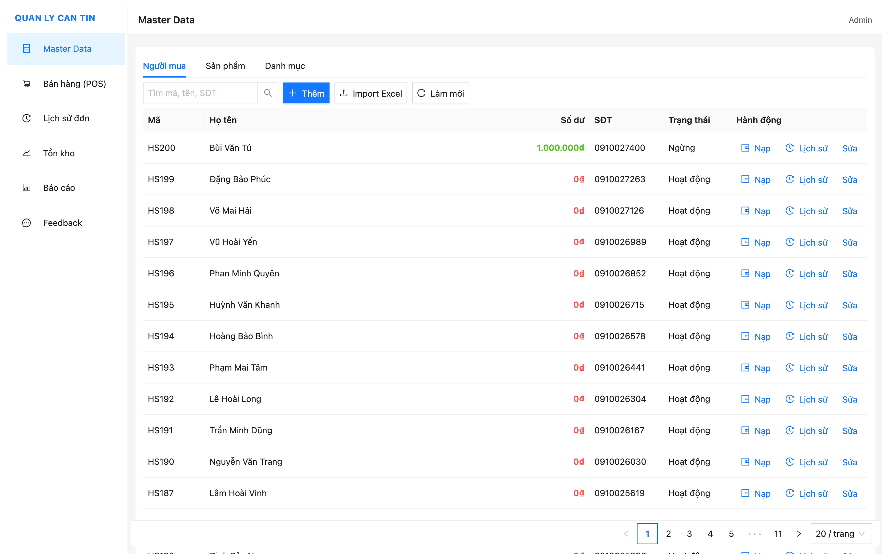
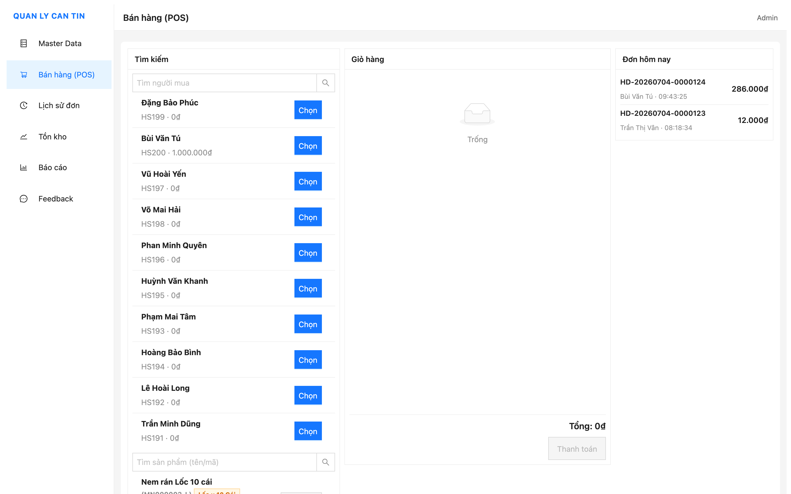
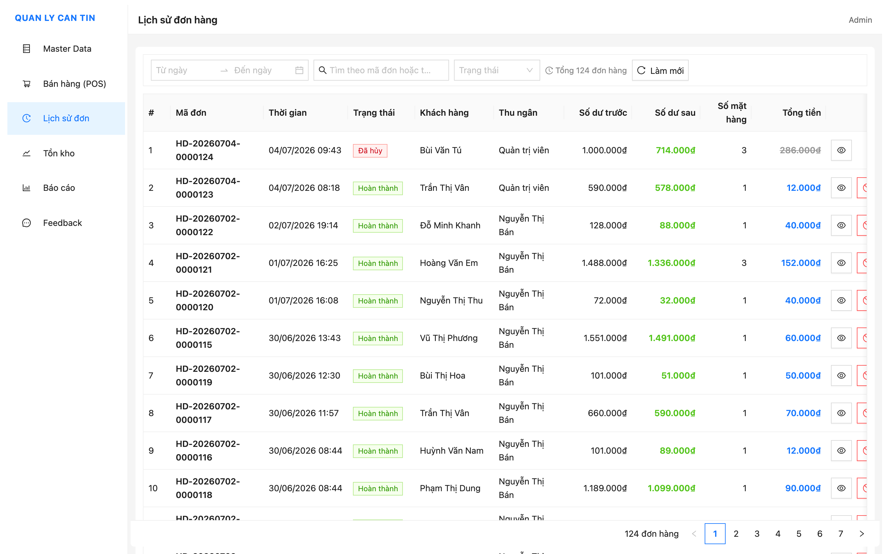
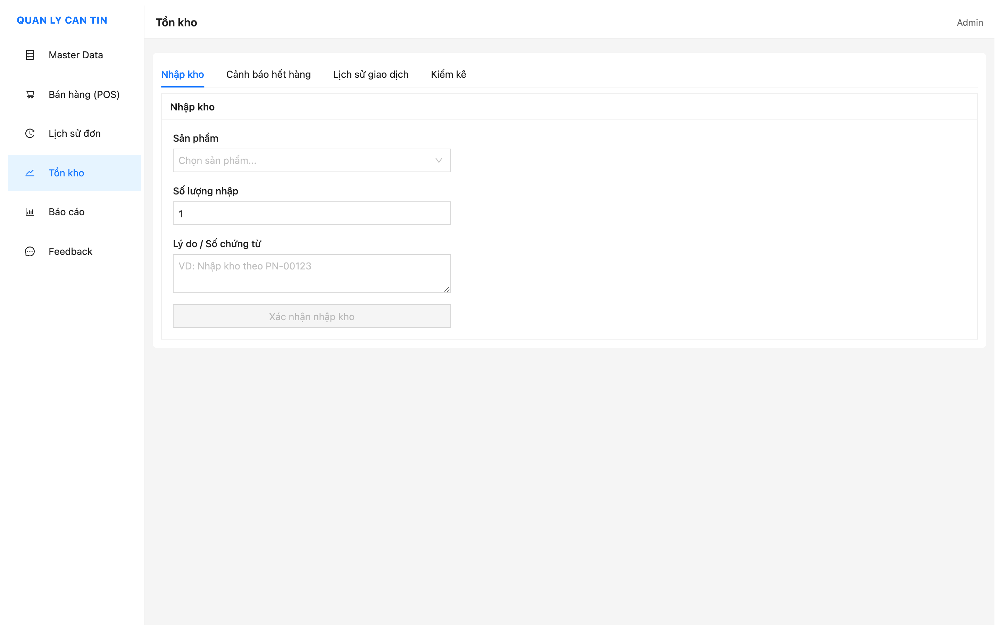
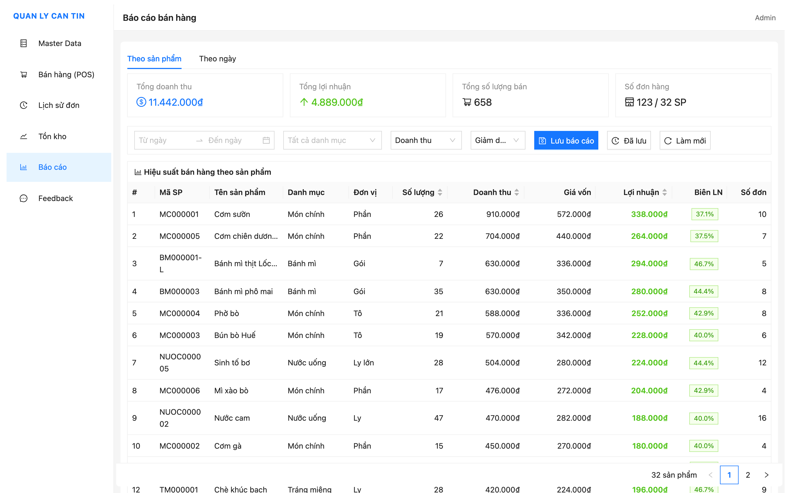
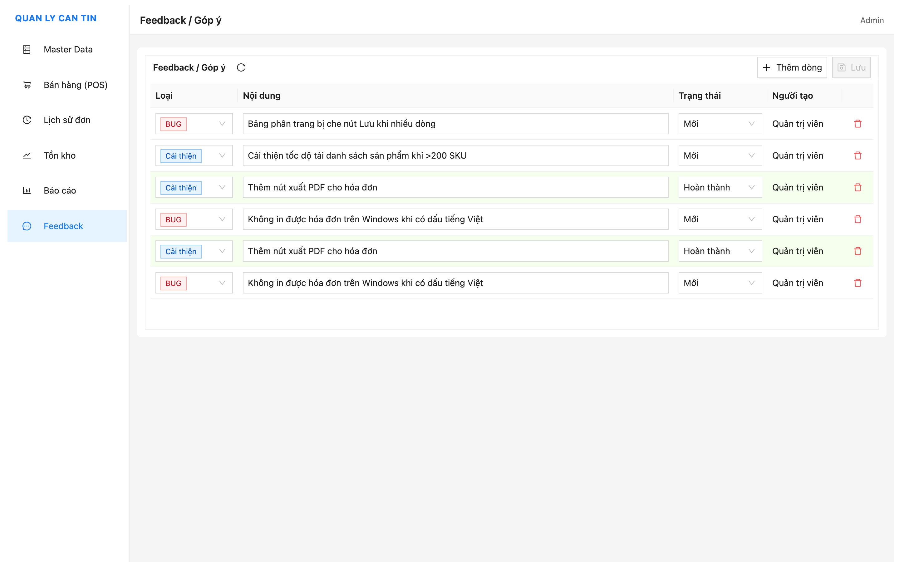

# Quản lý Căn tin

Ứng dụng desktop POS + Quản lý kho cho căn tin / tiệm tạp hóa, xây dựng bằng **Electron + React + TypeScript + Ant Design** (frontend) và **Express + Prisma + PostgreSQL** (backend).

## Tính năng chính

- **Bán hàng (POS)** — tạo đơn hàng, chọn sản phẩm, tính tiền, thanh toán qua tài khoản người mua (trừ balance tự động)
- **Tài khoản người mua** — mỗi người mua có số dư (balance); nạp tiền (topup) ghi lại balanceBefore/After; đơn hàng tự động trừ balance, chặn nếu số dư không đủ
- **Quản lý sản phẩm** — CRUD sản phẩm, mã tự động sinh (Category.prefix + 6-digit), giá bán/giá vốn, tồn kho hiện tại
- **Quản lý kho** — nhập/xuất/điều chỉnh tồn kho, kiểm kê (stock count)
- **Chuyển đổi đơn vị** — 1 thùng = 30 gói, tự động quy đổi khi bán/nhập; tạo base + bundle trong 1 form
- **Báo cáo hiệu suất bán hàng** — thống kê doanh thu, lợi nhuận, biên lợi nhuận theo sản phẩm; bộ lọc theo khoảng ngày, danh mục; sắp xếp theo doanh thu/lợi nhuận/số lượng/tên; lưu/xem/xóa snapshot báo cáo
- **Danh mục, đơn vị, khách hàng** — master data CRUD
- **Feedback / Góp ý** — bảng editable ghi nhận bug và đề xuất cải thiện (loại BUG/Cải thiện, trạng thái Mới/Hoàn thành, row Hoàn thành tô xanh)
- **Phân quyền** — ADMIN, MANAGER, CASHIER, WAREHOUSE
- **Logging toàn diện (log4js)** — ghi lại HTTP requests, SQL queries, CRUD mutations, order/topup/stock operations, auth, validation errors, error stack traces (xem section Logging)

## Ảnh chụp màn hình

| Tính năng | Ảnh |
|-----------|-----|
| Master Data (sản phẩm, danh mục, đơn vị, khách hàng) |  |
| Bán hàng (POS) |  |
| Lịch sử đơn hàng |  |
| Tồn kho (nhập/xuất/kiểm kê) |  |
| Báo cáo bán hàng |  |
| Feedback / Góp ý |  |

## Kiến trúc

```
quan-ly-can-tin/
├── apps/
│   ├── backend/          # Express + Prisma + PostgreSQL
│   │   ├── prisma/
│   │   │   ├── schema.prisma         # Data model
│   │   │   ├── seed.ts               # Dữ liệu mẫu (master data)
│   │   │   ├── reset-and-simulate.ts # Reset DB + seed + giả lập 30 ngày bán hàng
│   │   │   └── simulate-stock-counts.ts # Giả lập phiên kiểm kê
│   │   └── src/
│   │       ├── routes/          # API endpoints
│   │       ├── services/        # Business logic
│   │       ├── middleware/      # Auth, error handler, validate
│   │       ├── schemas/        # Zod validation
│   │       ├── utils/          # unaccent search
│   │       ├── logger.ts       # log4js config (app/sql/http/error)
│   │       └── prisma.ts       # Prisma client + SQL event hooks
│   └── frontend/         # Electron + React + Vite + Ant Design
│       └── src/
│           ├── features/       # POS, inventory, master-data, reports
│           ├── stores/         # Zustand state
│           ├── api/            # Axios client
│           └── utils/
├── shared/               # @shared/api-types (Zod schemas, TypeScript types)
└── package.json          # NPM workspaces root
```

## Công nghệ

| Layer      | Stack |
|------------|-------|
| Frontend   | React 18, TypeScript, Ant Design 5, React Router 6, Zustand, TanStack Query, Axios |
| Desktop    | Electron 31, electron-vite, electron-builder |
| Backend    | Express 4, TypeScript, Prisma 5, Zod, JWT, log4js |
| Database   | PostgreSQL |
| Monorepo   | NPM workspaces |

## Logging (log4js)

Backend ghi log toàn diện bằng log4js. Log files nằm tại `apps/backend/logs/`, xoay vòng theo ngày (daily rotation):

| File | Nội dung | Giữ lại |
|------|---------|---------|
| `app.YYYY-MM-DD.log` | HTTP requests, CRUD mutations, order create, topup, stock operations, login, validation errors | 14 ngày |
| `sql.YYYY-MM-DD.log` | Tất cả Prisma SQL queries (dev only) | 14 ngày |
| `error.YYYY-MM-DD.log` | Lỗi 5xx (stack trace) + 4xx business errors (warn) | 30 ngày |

Kiểm tra log khi debug:

```bash
# Lỗi gần nhất
tail -100 apps/backend/logs/error.$(date +%Y-%m-%d).log

# Tìm operation theo keyword
grep "Order\|Topup\|Stock\|Login" apps/backend/logs/app.$(date +%Y-%m-%d).log

# Check SQL (dev only)
grep "<keyword>" apps/backend/logs/sql.$(date +%Y-%m-%d).log
```

Log entries chính:
- `INFO`: Order create START/OK, Stock-IN/OUT/ADJUST, Topup, Customer/Product/Category CRUD, Login success
- `WARN`: Order REJECTED (insufficient stock/balance), Stock-OUT REJECTED, Auth 401/403, Validation failed
- `ERROR`: 5xx errors with stack trace

## Khởi động nhanh

### Yêu cầu

- Node.js ≥ 18
- PostgreSQL đang chạy trên `localhost:5432`

### Cài đặt

```bash
npm install
```

### Cấu hình

Tạo `apps/backend/.env` từ `.env.example`:

```env
DATABASE_URL="postgresql://postgres:<password>@localhost:5432/canteen_db?schema=public"
JWT_SECRET="<your-secret>"
PORT=4000
NODE_ENV="development"
```

### Tạo database & seed

```bash
npm run db:migrate
npm run db:seed
```

### Reset toàn bộ DB + seed + giả lập 30 ngày bán hàng

```bash
cd apps/backend && npx tsx prisma/reset-and-simulate.ts
```

Script này xoá sạch toàn bộ dữ liệu (orders, products, customers, inventory, stock counts, reports), reset PostgreSQL sequences, seed lại master data (users, units, categories, customer groups, 28 base products + 4 bundle products, 30 customers), tạo topup transactions, rồi giả lập 30 ngày bán hàng qua `orderService.create` logic (trừ kho + trừ balance + inventory transactions). Cuối cùng in ra verification: stock consistency, cross-check doanh thu, product sales report, daily sales.

### Giả lập phiên kiểm kê (stock count)

```bash
cd apps/backend && npx tsx prisma/simulate-stock-counts.ts
```

Tạo 4 phiên kiểm kê cách nhau 7 ngày, mỗi phiên nhập số thực có lệch ngẫu nhiên (thừa/thiếu 0-5) cho ~30% sản phẩm, finalize (cập nhật stock + tạo COUNT inventory transactions), rồi kiểm tra: stock consistency (current = initial - sold + count_adj), cross-check SUM(items.difference) = SUM(COUNT transactions).

### Chạy dev (backend + frontend)

```bash
npm run dev
```

- Backend: http://localhost:4000
- Frontend: mở cửa sổ Electron tự động

### Đăng nhập mặc định

| Vai trò  | Username   | Password   |
|----------|------------|------------|
| Admin    | `admin`    | `admin`    |
| Thu ngân | `cashier`  | `cashier`  |

## Build production

```bash
npm run build          # build shared + backend + frontend
npm run electron:pack  # đóng gói Electron app
```

## Các script

| Script               | Mô tả                                     |
|----------------------|-------------------------------------------|
| `npm run dev`        | Chạy backend + frontend cùng lúc           |
| `npm run build`      | Build tất cả workspace                    |
| `npm run db:migrate` | Chạy Prisma migrate                       |
| `npm run db:seed`    | Seed dữ liệu mẫu                          |
| `npm run db:studio`  | Mở Prisma Studio (trong apps/backend)     |
| `npm run electron:pack` | Đóng gói Electron app                 |

## API endpoints

| Prefix                    | Mô tả               |
|---------------------------|----------------------|
| `/api/v1/auth`            | Đăng nhập, refresh   |
| `/api/v1/products`        | Sản phẩm             |
| `/api/v1/categories`      | Danh mục             |
| `/api/v1/units`           | Đơn vị               |
| `/api/v1/customers`       | Khách hàng (CRUD + topup + lịch sử nạp) |
| `/api/v1/customer-groups` | Nhóm khách hàng      |
| `/api/v1/orders`          | Đơn hàng             |
| `/api/v1/inventory`       | Nhập/xuất/điều chỉnh tồn kho |
| `/api/v1/stock-counts`   | Kiểm kê (tạo, cập nhật số thực, finalize) |
| `/api/v1/reports`         | Hiệu suất bán hàng (product-sales), doanh thu theo ngày (daily-sales) |
| `/api/v1/reports/saved`  | Báo cáo đã lưu (CRUD snapshot)    |
| `/api/v1/feedback`      | Feedback / Góp ý (CRUD, bulk update) |

## Data model

Các entity chính: **User**, **Customer**, **CustomerGroup**, **Category**, **Unit**, **Product**, **Order**, **OrderItem**, **InventoryTransaction**, **TopupTransaction**, **StockCount**, **StockCountItem**, **ProductPerformanceReport**, **ProductPerformanceReportItem**, **Feedback**, **AuditLog**.

Xem chi tiết trong `apps/backend/prisma/schema.prisma`.

## License

Private